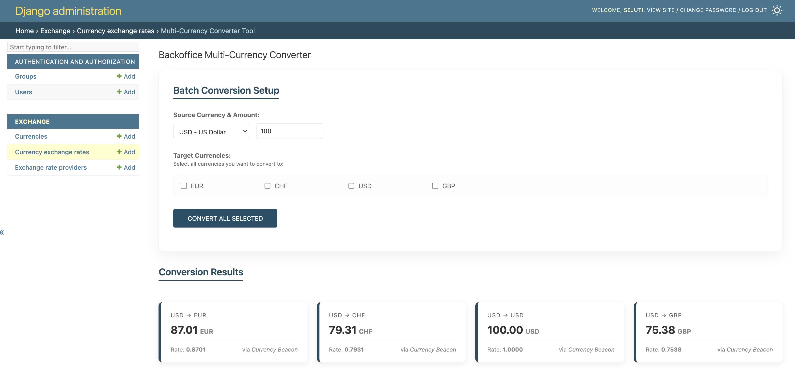

# MyCurrency - Exchange Rate Platform

MyCurrency is a web platform for calculating and tracking currency exchange rates. It integrates with external providers like CurrencyBeacon to provide real-time and historical data.

## Features

- **Multi-Source Resilience**: Automatically falls back to secondary providers if a primary source is unavailable.
- **Primary Data Provider**: Integrated with [CurrencyBeacon](https://currencybeacon.com/api-documentation#historical-rates) for high-accuracy historical and real-time rates.
- **Backoffice Converter**: A dedicated admin tool for performing batch currency conversions.
- **REST API**: Full-featured API for currency management, historical rates, and live conversions.
- **Automated Data Loading**: Includes tools for bulk-ingesting historical rate data.

## Tech Stack

- **Python 3.11**
- **Django 5.x**
- **Django REST Framework**
- **PostgreSQL**
- **Docker & Docker Compose**

## Quick Access (Once running)

- **Admin Backoffice**: [http://localhost:8000/admin/](http://localhost:8000/admin/)
- **API Root**: [http://localhost:8000/api/](http://localhost:8000/api/)

## Setup & Installation (Docker - Recommended)

The easiest way to get started is using Docker and Docker Compose. This will stand up both the PostgreSQL database and the Django application with a single command.

1. **Clone the repository.**
2. **Create your `.env` file** in the root directory:
   ```bash
   cp .env.example .env
   ```
3. **Edit the `.env` file** and add your `CURRENCY_BEACON_API_KEY`.
4. **Start the application:**
   ```bash
   docker-compose up --build
   ```
5. **Setup Admin Account & Data:**
   In a separate terminal window:
   ```bash
   docker-compose exec web python manage.py createsuperuser
   docker-compose exec web python manage.py load_historical_rates 2026-01-01 2026-03-22
   ```

## API Endpoints

- **Live Conversion**: `POST /api/convert/`
  - Body: `{"source_currency": "USD", "exchanged_currency": "EUR", "amount": 100.00}`
- **Historical Rates**: `GET /api/rates/?source_currency=USD&date_from=2024-01-01&date_to=2024-01-31`
- **Currency Management**: `GET/POST /api/currencies/`

## Manual Setup (Non-Docker)

1. **Install dependencies:** `pip install -r requirements.txt`
2. **Prepare Environment:** `cp .env.example .env` (Set `POSTGRES_HOST=127.0.0.1`)
3. **Initialize Database:**
   ```bash
   python manage.py migrate
   python manage.py createsuperuser
   ```
4. **Run Server:** `python manage.py runserver`


## Backoffice Multi-Converter

The Backoffice Multi-Converter is a custom tool designed for administrators to perform batch currency conversions efficiently. It allows for the selection of a single source currency and multiple target currencies simultaneously, displaying the results in a clear, card-based interface.



[http://localhost:8000/admin/exchange/currencyexchangerate/currency_converter/](http://localhost:8000/admin/exchange/currencyexchangerate/currency_converter/)

## Testing with Postman

A pre-configured Postman collection is included in the project root: **`postman_collection.json`**.

### **How to Use**:
1.  **Open Postman** and click **Import**.
2.  **Select** the `postman_collection.json` file from the project directory.
3.  **Ensure the `base_url`** variable in your environment is set to `http://localhost:8000`.
4.  **Run** any of the requests (e.g., *Get Rate Series* or *List Currencies*) to verify the API responses.
